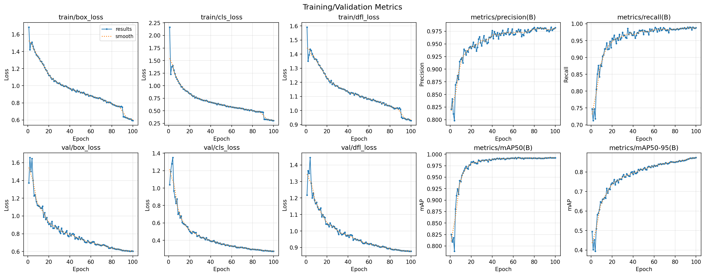
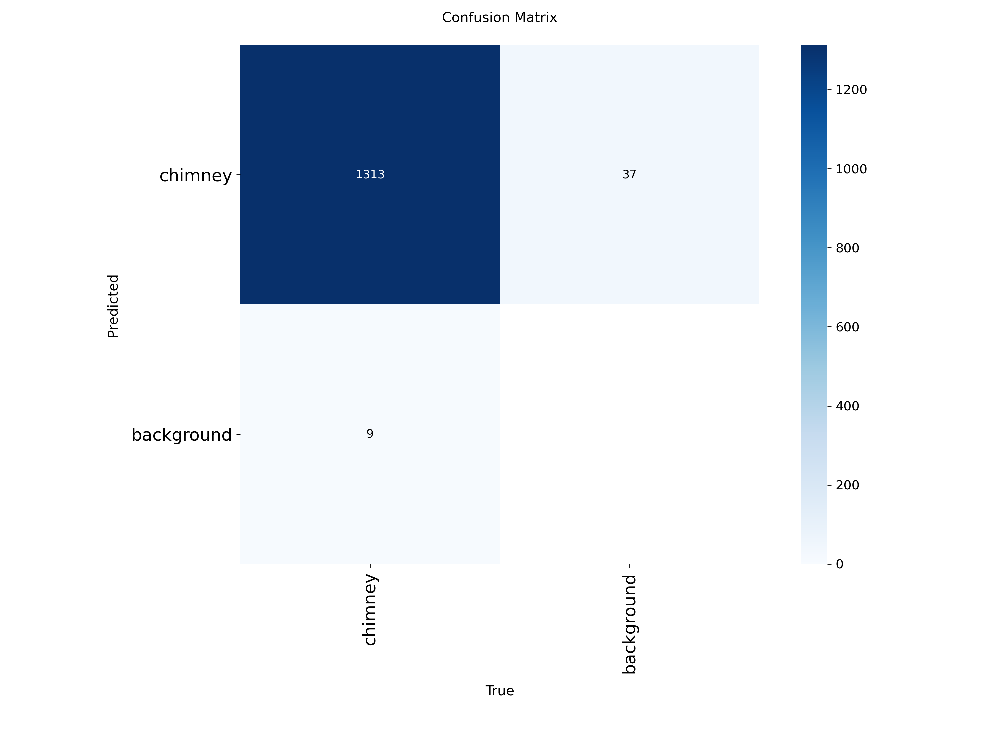
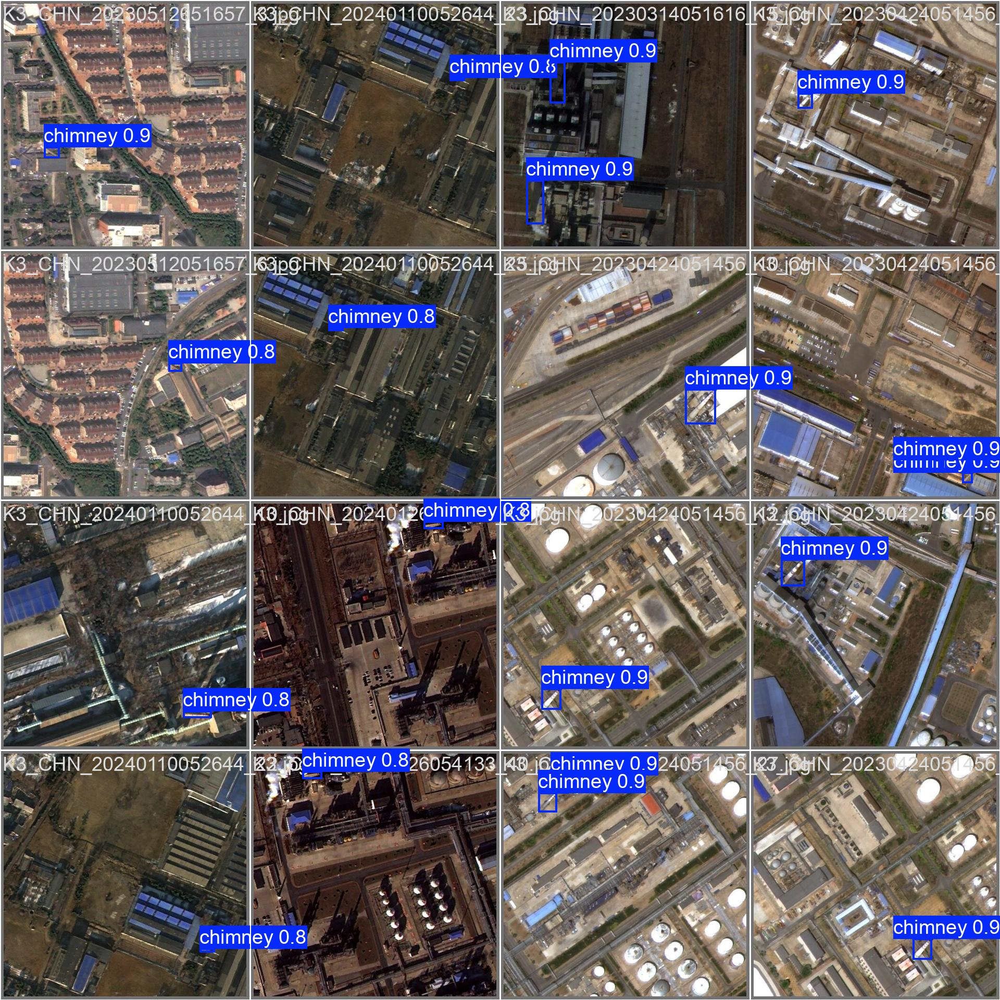
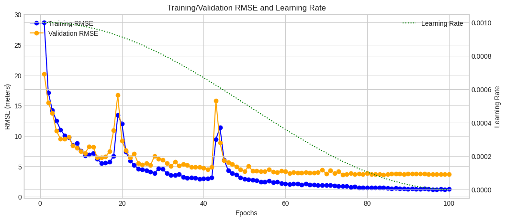
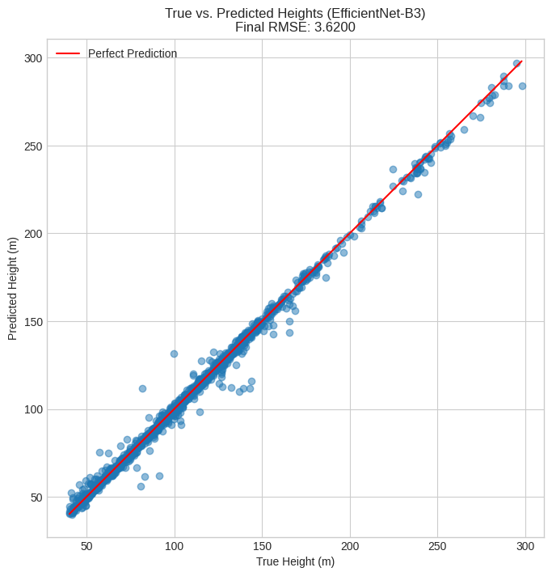
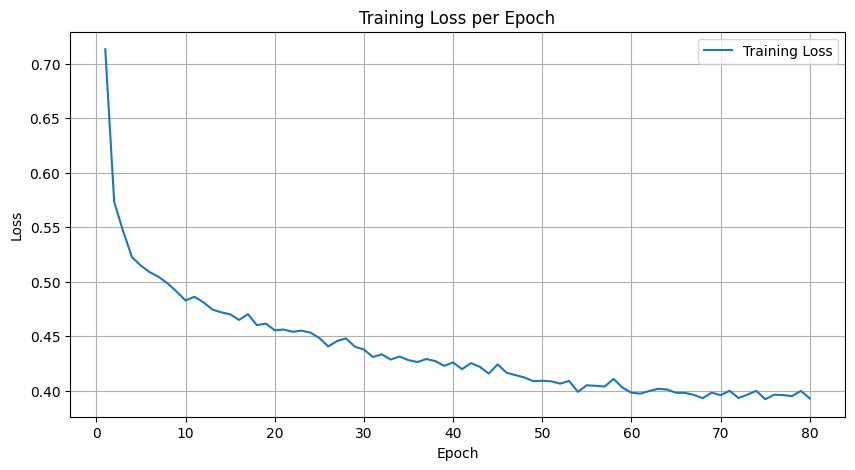
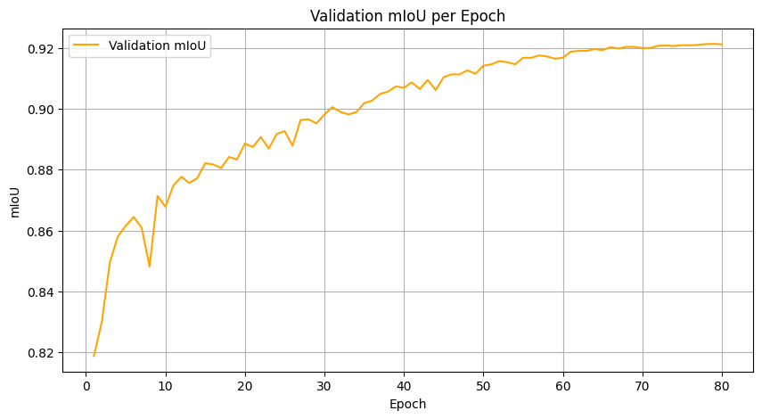
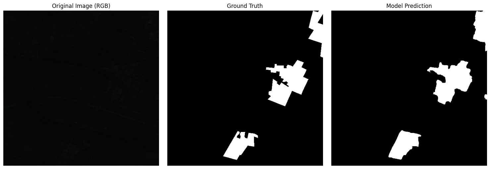

# 🛰️ 위성 영상 기반 대기오염 배출원 탐지 프로젝트

과학기술정보통신부 주관 [**데이터 크리에이터 캠프**](https://kbig.kr/portal/kbig/keybiz.page)에서 수행한 팀 프로젝트입니다. 위성 영상을 이용해 대기오염 배출원(굴뚝·산업단지)을 탐지·분석하는 3단계 AI 파이프라인을 구축했습니다.

- **소속**: 동국대학교, 4인 팀 (**팀장**으로 참여)
- **데이터셋**: [AI-Hub 대기오염 배출원 공간 분포 데이터](https://aihub.or.kr) — 위성/항공 영상 및 JSON 라벨
- **개발 환경**: Google Colab (GPU), PyTorch

<br>

## Pipeline Overview

세 미션은 하나의 파이프라인으로 이어집니다: 위성 영상에서 굴뚝을 **탐지**하고 → 굴뚝의 **높이를 추정**하고 → 배출원이 위치한 **산업단지 영역을 분할**합니다.

| Mission | Task | 모델 | 핵심 지표 |
|---|---|---|---|
| [Mission 1](#mission-1-굴뚝-위치-탐지-object-detection) | 굴뚝 위치 탐지 (Object Detection) | YOLOv8m | mAP50-95 **0.873** |
| [Mission 2](#mission-2-굴뚝-높이-추정-regression) | 굴뚝 높이 추정 (Regression) | EfficientNet-B3 | RMSE **3.62m** |
| [Mission 3](#mission-3-산업단지-영역-분할-semantic-segmentation) | 산업단지 영역 분할 (Semantic Segmentation) | U-Net (ResNet34) | mIoU **0.921** |

<br>

## 나의 역할과 기여

팀장으로서 프로젝트 방향 설정, 일정 관리를 담당했고, Mission 1(Detection)과 Mission 2(Regression)를 직접 설계·구현했습니다.

**Mission 1 — 데이터 파이프라인 구축 및 모델 학습**
- JSON 라벨(Bounding Box 좌표, 이미지 크기)을 YOLOv8 학습용 정규화 좌표(.txt)로 변환하는 파이프라인을 작성
- 약 9,000개 이상의 라벨-이미지 쌍을 매칭 검증하는 과정에서 누락된 데이터를 자동 감지해 제외하는 로직을 설계
- YOLOv8m fine-tuning으로 **mAP50-95 0.873**, mAP50 0.992 달성

**Mission 2 — 문제 진단과 개선 전략 설계**
- EfficientNet-B3 기반 회귀 모델의 예측 오차를 분석해 **50~200m 구간에 오차가 집중**되는 문제를 진단
- 이를 해결하기 위해 ① 구간별 차등 데이터 증강, ② `WeightedRandomSampler` 기반 가중 샘플링, 두 가지 전략을 설계·비교
- 가중 샘플링 방식을 채택해 **RMSE 3.62m** 달성

Detection·Regression·Segmentation을 한 프로젝트에서 모두 다루면서, 단순히 모델을 바꾸기보다 **성능 저하의 원인을 데이터 분포 관점에서 정확히 진단하고, 그 특성에 맞는 해결책을 찾는 것**이 더 중요하다는 점을 배웠습니다.

<br>

## Mission 1: 굴뚝 위치 탐지 (Object Detection)

위성 영상에서 굴뚝의 위치를 Bounding Box로 탐지하는 미션입니다.

- **데이터 전처리**: VIA 포맷 JSON 라벨 → YOLO 정규화 좌표(`class x_center y_center width height`) 변환. 이미지-라벨 쌍 존재 여부를 검증해 누락 데이터를 자동으로 걸러내고, 재실행 시 이미 변환된 항목은 건너뛰는 resume 로직을 구현
- **모델**: `yolov8m.pt`를 기반으로 100 epoch fine-tuning (imgsz 1024, batch 24, mosaic/mixup/rotation 등 augmentation 적용)

| 지표 | 값 |
|---|---|
| mAP50 | 0.992 |
| mAP50-95 | 0.873 |
| Precision | 0.982 |
| Recall | 0.988 |

<p align="center">
  
</p>
<p align="center">
  
  
</p>

<br>

## Mission 2: 굴뚝 높이 추정 (Regression)

Mission 1에서 탐지된 굴뚝 영역을 crop하여, 굴뚝의 실제 높이(m)를 추정하는 회귀 미션입니다.

- **모델**: ImageNet 사전학습 EfficientNet-B3 (출력 1개 노드의 회귀 head)
- **문제 진단**: 초기 모델은 50~200m 구간에서 예측 오차가 두드러지게 컸음
- **해결**: 해당 구간 샘플에 1.5배 가중치를 부여하는 `WeightedRandomSampler`를 적용해 학습 시 더 자주 노출되도록 조정 → 구간별 증강 대비 더 우수한 결과로 채택

| 지표 | 값 |
|---|---|
| Best Validation RMSE | **3.62 m** |

<p align="center">
  
  
</p>

<br>

## Mission 3: 산업단지 영역 분할 (Semantic Segmentation)

4채널(R/G/B/NIR) 위성 영상에서 배출원이 위치한 산업단지 영역을 픽셀 단위로 분할하는 미션입니다.

- **모델**: ResNet34 인코더 기반 U-Net (`segmentation_models_pytorch`), 입력 4채널 / 출력 2클래스
- **손실 함수**: CrossEntropy + Dice Loss 조합
- **평가**: mIoU (Jaccard Score, macro average)

| 지표 | 값 |
|---|---|
| Best Validation mIoU | **0.921** |

<p align="center">
  
  
</p>
<p align="center">
  
</p>

<br>

## 기술 스택

`PyTorch` `Ultralytics YOLOv8` `timm (EfficientNet)` `segmentation-models-pytorch` `Albumentations` `OpenCV` `rasterio` `Google Colab`

<br>

## 저장소 구조

```
DCC/
├── mission1/                  # 굴뚝 위치 탐지 (YOLOv8)
│   ├── dcc_m1.ipynb
│   ├── requirements.txt
│   └── results/               # 학습/검증 결과 요약 (그래프, 지표, 예측 샘플)
├── mission2/                  # 굴뚝 높이 추정 (EfficientNet-B3)
│   ├── dcc_m2.ipynb
│   ├── requirements.txt
│   └── results/
└── mission3/                  # 산업단지 영역 분할 (U-Net)
    ├── dcc_m3.ipynb
    ├── requirements.txt
    └── results/
```

> 학습된 모델 가중치(`.pth`)와 원본 학습 산출물(`.zip`)은 용량 문제로 저장소에 포함하지 않았으며, 핵심 결과는 각 `results/` 폴더에 이미지·지표로 정리되어 있습니다.


<br>

## 실행 방법

각 노트북은 Google Colab 환경(Google Drive 마운트, GPU) 기준으로 작성되었습니다.

1. 실행할 미션 폴더의 `requirements.txt`를 설치합니다.
   ```bash
   pip install -r mission1/requirements.txt   # 또는 mission2, mission3
   ```
2. 노트북 상단의 `★` 표시가 붙은 경로 변수(`DRIVE_ROOT`, `RESULTS_DIR` 등)를 본인 환경에 맞게 수정합니다.
3. 셀을 순서대로 실행합니다. (AI-Hub 데이터셋 다운로드 및 Google Drive 업로드가 선행되어야 합니다.)

<br>

## 데이터 출처

- [AI-Hub](https://aihub.or.kr) — 대기오염 배출원 공간 분포 데이터 (한국지능정보사회진흥원)
